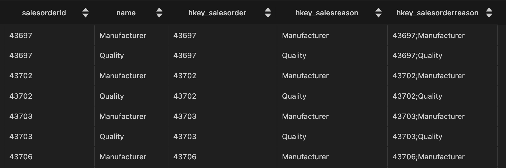

# Docker와 Hadoop 생태계를 활용한 데이터 엔지니어링 프로젝트

## 개요
Docker를 사용하여 Hadoop 생태계의 구성 요소와 기타 필수 서비스를 컨테이너화하여 강력한 데이터 엔지니어링 환경을 설정하는 방법을 보여줍니다. 설정에는 `Hadoop` (`HDFS`, `YARN`), `Apache Hive`, `PostgreSQL` 및` Apache Airflow`가 포함되며, 이들 모두가 원활하게 작동하도록 구성되어 있습니다. ETL에는 `Apache Airflow`를 이용하고, DataVault 모델링 기법을 사용하여 데이터를 적재합니다.

모델링 코드는 [ETL Best practices with airflow](https://github.com/gtoonstra/etl-with-airflow)의 `datavault2`의 airflow code를 기반으로합니다. 


## 목적
1. 하둡 생태계의 구성을 알기쉽게 docker container로 구성하고 Web UI를 통해 모니터링할 수 있는 환경울 구성합니다.
2. Airflow를 통해 `PostgreSQL -> HDFS -> Bigquery`로 데이터를 옮기고 모델링하여 저장하는 파이프라인을 구축합니다. 
3. DataVault 방식의 데이터모델링 예시를 보여줍니다. 


## 프로젝트 상세

### Overall flow

**architecture**


**data flow**


### Data Vault 모델

#### Data Vault란?
Data Vault는 엔터프라이즈급 분석을 위한 데이터 웨어하우스를 구축하는 데 사용되는 데이터 모델링 설계 패턴입니다. Data Vault는 데이터의 통합과 확장성에 중점을 둔 모델링 기법으로, 변화하는 비즈니스 요구사항과 소스 시스템에 대응할 수 있는 유연성을 제공합니다. Data Vault는 hub, link, satillite, 이렇게 세 가지 유형의 엔터티가 있습니다.

- **hub**: 각 hub는 고객 ID/제품 이름/차량 식별 번호(VIN)와 같은 핵심 비즈니스 개념을 나타냅니다. 사용자는 *비즈니스 키를 사용하여 hub에 대한 정보를 얻으며* 비즈니스 키에는 비즈니스 개념 ID 및 시퀀스 ID, 로드 날짜 그리고 기타 메타데이터 정보가 조합되어 있을 수 있습니다. 입력 전용이며 허브에서 데이터는 변경되지 않습니다.
- **link**: link는 hub 엔터티 간의 관계를 나타냅니다. link 테이블은 다양한 hub의 데이터를 연결하므로 다대다 관계입니다. Data Vault 모델의 관계는 간단하며 link 변경을 통해 처리됩니다. 
- **satillite**: satillite은 누락된 핵심 비즈니스 개념 설명 정보에 대한 추가 정보를 제공합니다. satillite은 hub와 hub 사이의 관계에 속하는 정보를 저장합니다.

추가적인 특성으로는 다음 같은 것들이 있습니다. 
- satillite은 다른 satillite과 직접적으로 연결될 수 없습니다.
- hub 또는 link는 하나 이상의 satillite을 가질 수 있습니다.

데이터 볼트가 유연하게 파이프라인을 설계할 수 있는 주요 이유는 다음과 같습니다:
1. 모듈화된 구조: 데이터 볼트는 Hub, Satellite, Link의 세 가지 주요 컴포넌트로 구성됩니다. 이러한 모듈화된 구조는 소스 시스템의 변경이나 추가 데이터 소스의 통합이 필요할 때 파이프라인에 대한 큰 수정 없이 쉽게 대응할 수 있습니다.
2. 변화에 강함: 전통적인 데이터 웨어하우스 설계 방식에 비해, Data Vault는 소스 시스템의 변경에 대응하기 쉽습니다. 예를 들면, 소스 시스템에서 필드가 추가되거나 제거되는 경우, Satellite 테이블만 수정하면 됩니다.
3. 시간 변동성: 데이터 볼트는 데이터의 시간적 변동성을 관리하기 위한 설계를 갖추고 있습니다. 이로 인해 시간에 따른 데이터의 변화를 쉽게 추적하고 저장할 수 있습니다.
4. 병렬 처리: 볼트의 모듈화된 구조는 병렬로 데이터를 로드하는 것을 용이하게 합니다. 이는 ETL(Extract, Transform, Load) 또는 ELT(Extract, Load, Transform) 프로세스를 통한 데이터 로딩 속도를 향상시킬 수 있습니다.
5. 확장성: 새로운 데이터 소스나 비즈니스 요구사항이 생겨나더라도, 기존의 아키텍처와 파이프라인을 크게 변경할 필요 없이 통합이 가능합니다.


#### Data Vault flow


1. staging
- staging 단계에서는 RDBMS에 있던 데이터를 거의 그대로 HDFS로 로드합니다.
- 각 hub에서 비즈니스 키로 사용할 컬럼을 추가합니다. 

RDBMS에서 데이터를 가져오는 예시는 다음과 같습니다. 
```SQL
SELECT
      sohsr.salesorderid
    , sr.name
    , LTRIM(RTRIM(COALESCE(CAST(sohsr.salesorderid as varchar), ''))) as hkey_salesorder
    , LTRIM(RTRIM(COALESCE(CAST(sr.name as varchar), ''))) as hkey_salesreason
    , CONCAT(
          LTRIM(RTRIM(COALESCE(CAST(sohsr.salesorderid as varchar), ''))), ';'
        , LTRIM(RTRIM(COALESCE(CAST(sr.name as varchar), '')))
      ) as hkey_salesorderreason
FROM
    sales.salesorderheadersalesreason sohsr
INNER JOIN  sales.salesreason sr ON sohsr.salesreasonid = sr.salesreasonid 
```


staging 단계에서 airflow는 다음의 순서로 데이터를 추출하고 로드합니다: 
- PostgreSQL에서 위 쿼리로 가져온 데이터를 Airflow 임시 파일 저장소에 씁니다.
- hdfs 명령(`hdfs dfs -put airflow/tmp/file/path hdfs/destination/file/path`)으로 임시 파일을 hdfs로 옮깁니다.
- hive 명령(`LOAD DATA INPATH 'hdfs/destination/file/path' OVERWRITE INTO TABLE tablename_20240523t000000;`)으로 hdfs 데이터를 테이블 형태로 씁니다.


2. hub
- hub는 핵심 비즈니스 개념을 나타냅니다.
- hub, link, satillite 단계에는 HQL로 데이터를 transform하여 저장합니다. 

```HQL
SELECT
      sod.salesorderid
    , sod.salesorderdetailid
    , sod.carriertrackingnumber
    , sod.orderqty
    , sod.productid
    , sod.specialofferid
    , sod.unitprice
    , sod.unitpricediscount
    , LTRIM(RTRIM(COALESCE(CAST(sod.salesorderdetailid as varchar), ''))) as hkey_salesorderdetail
    , LTRIM(RTRIM(COALESCE(CAST(sod.salesorderid as varchar), ''))) as hkey_salesorder
    , LTRIM(RTRIM(COALESCE(CAST(so.specialofferid as varchar), ''))) as hkey_specialoffer
    , LTRIM(RTRIM(COALESCE(CAST(p.productnumber as varchar), ''))) as hkey_product
FROM
    sales.salesorderdetail sod
INNER JOIN  sales.specialoffer so ON sod.specialofferid = so.specialofferid
INNER JOIN  production.product p ON sod.productid = p.productid
```


3. link
- hub 엔터티 간의 관계를 나타냅니다.

예시는 다음과 같습니다. 
```HQL
INSERT INTO TABLE dv_raw.link_salesorder_address
SELECT DISTINCT
    a.hkey_salesorder_address,
    a.hkey_salesorder,
    a.hkey_address_billtoaddressid,
    a.hkey_address_shiptoaddressid,
    a.record_source,
    a.load_dtm
FROM
    advworks_staging.salesorderheader_{{execution_date.strftime('%Y%m%dt%H%M%S')}} a
WHERE
    NOT EXISTS (
        SELECT 
                l.hkey_salesorder_address
        FROM    dv_raw.link_salesorder_address l
        WHERE 
                l.hkey_address_billtoaddressid = a.hkey_address_billtoaddressid
        AND     l.hkey_address_shiptoaddressid = a.hkey_address_shiptoaddressid
    )
```

4. satellite
- satillite은 누락된 핵심 비즈니스 개념 설명 정보에 대한 추가 정보를 제공합니다. 

예시는 다음과 같습니다. 
```HQL
INSERT INTO TABLE dv_raw.sat_salesreason
SELECT DISTINCT
      sr.hkey_salesreason
    , sr.load_dtm
    , NULL
    , sr.record_source
    , sr.name
    , sr.reasontype
FROM
    advworks_staging.salesreason_{{execution_date.strftime('%Y%m%dt%H%M%S')}} sr
LEFT OUTER JOIN dv_raw.sat_salesreason sat ON (
        sat.hkey_salesreason = sr.hkey_salesreason
        AND sat.load_end_dtm IS NULL)
WHERE
    COALESCE(sr.name, '') != COALESCE(sat.name, '')
    OR COALESCE(sr.reasontype, '') != COALESCE(sat.reasontype, '')

```

### Docker Container
이 프로젝트 root directory에서 `docker-compose -f docker-compose-datavault2 up -d` 명령을 실행하면 다음과 같은 docker container 들이 실행됩니다. 


## 사용 방법
1. clone repository
```bash
git clone <repository-url>
cd <repository-directory>
```

2. 구성 파일 확인
hadoop_config 파일과 기타 구성 파일(e.g., hive-site.xml, core-site.xml 등)이 지정된 디렉토리에 올바르게 설정되었는지 확인합니다.

3. docker-compose 시작
```bash
docker-compose -f docker-compose-datavault2 up -d
```

4. 서비스 액세스:
- Hadoop NameNode UI: http://localhost:9870
- ResourceManager UI: http://localhost:8088
- HIVE UI: http://localhost:10002
- Airflow Web UI: http://localhost:8080

참고:
- BigQuery 예제를 보려면 자체 Google 클라우드 프로젝트가 활성화되어 있어야 하며, 최소한 Google 클라우드 저장소 및 bigquery 편집 권한(또는 프로젝트 편집 권한 부여)이 있는 자체 서비스 계정을 설정해야 합니다. 그런 다음 해당 프로젝트의 bigquery에서 "information_mart" 데이터 집합을 만들고 원하는 버킷 이름을 만들어야 합니다. bigquery 연결이 생성된 후 프로젝트 ID를 GCP의 프로젝트 ID로 변경합니다(이는 'default' Google 프로젝트로서 필요함).

## TODO

- [ ] HIVE 고도화(metastore 분리, 모니터링 기능)
- [ ] airflow celery worker 버전 
- [ ] use dbt