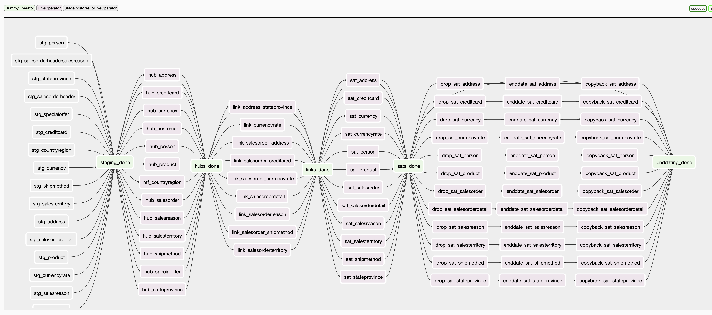

# Docker와 Hadoop 생태계를 활용한 데이터 엔지니어링 프로젝트

## 개요
Docker를 사용하여 Hadoop 생태계의 구성 요소와 기타 필수 서비스를 컨테이너화하여 강력한 데이터 엔지니어링 환경을 설정하는 방법을 보여줍니다. 설정에는 `Hadoop` (`HDFS`, `YARN`), `Apache Hive`, `PostgreSQL` 및` Apache Airflow`가 포함되며, 이들 모두가 원활하게 작동하도록 구성되어 있습니다. ETL에는 `Apache Airflow`를 이용하고, DataVault 모델링 기법을 사용하여 데이터를 적재합니다.

모델링 코드는 [ETL Best practices with airflow](https://github.com/gtoonstra/etl-with-airflow)의 `datavault2`의 airflow code를 기반으로합니다. 


## 목적
1. 하둡 생태계의 구성을 알기쉽게 docker container로 구성하고 Web UI를 통해 모니터링할 수 있는 환경울 구성합니다.
2. Airflow를 통해 `PostgreSQL -> HDFS -> Bigquery`로 데이터를 옮기고 모델링하여 저장하는 파이프라인을 구축합니다. 
3. DataVault 방식의 데이터모델링 예시를 보여줍니다. 


## 프로젝트 상세

### Overall flow


### Data Vault 모델

#### Data Vault란?

#### Data Vault flow


1. staging
```SQL
SELECT
      a.addressid
    , a.addressline1
    , a.addressline2
    , a.city
    , a.stateprovinceid
    , a.postalcode
    , a.spatiallocation
    , CONCAT(
          LTRIM(RTRIM(COALESCE(CAST(a.postalcode as varchar), ''))), ';'
        , LTRIM(RTRIM(COALESCE(CAST(a.addressline1 as varchar), ''))), ';'
        , LTRIM(RTRIM(COALESCE(CAST(a.addressline2 as varchar), '')))
      ) as hkey_address
    , CONCAT(
          LTRIM(RTRIM(COALESCE(CAST(sp.stateprovincecode as varchar), ''))), ';'
        , LTRIM(RTRIM(COALESCE(CAST(sp.countryregioncode as varchar), '')))
      ) as hkey_stateprovince
    , CONCAT(
          LTRIM(RTRIM(COALESCE(CAST(a.postalcode as varchar), ''))), ';'
        , LTRIM(RTRIM(COALESCE(CAST(a.addressline1 as varchar), ''))), ';'
        , LTRIM(RTRIM(COALESCE(CAST(a.addressline2 as varchar), ''))), ';'
        , LTRIM(RTRIM(COALESCE(CAST(sp.stateprovincecode as varchar), ''))), ';'
        , LTRIM(RTRIM(COALESCE(CAST(sp.countryregioncode as varchar), '')))
      ) as hkey_address_stateprovince
FROM
           person.address a
INNER JOIN person.stateprovince sp ON a.stateprovinceid = sp.stateprovinceid
```


2. hub
3. link
4. satilites


### Docker Container
이 프로젝트 root directory에서 `docker-compose -f docker-compose-datavault2 up -d` 명령을 실행하면 다음과 같은 docker container 들이 실행됩니다. 


## 사용 방법
1. clone repository
```bash
git clone <repository-url>
cd <repository-directory>
```

2. 구성 파일 확인
hadoop_config 파일과 기타 구성 파일(e.g., hive-site.xml, core-site.xml 등)이 지정된 디렉토리에 올바르게 설정되었는지 확인합니다.

3. docker-compose 시작
```bash
docker-compose -f docker-compose-datavault2 up -d
```

4. 서비스 액세스:
- Hadoop NameNode UI: http://localhost:9870
- ResourceManager UI: http://localhost:8088
- HIVE UI: http://localhost:10002
- Airflow Web UI: http://localhost:8080

참고:
- BigQuery 예제를 보려면 자체 Google 클라우드 프로젝트가 활성화되어 있어야 하며, 최소한 Google 클라우드 저장소 및 bigquery 편집 권한(또는 프로젝트 편집 권한 부여)이 있는 자체 서비스 계정을 설정해야 합니다. 그런 다음 해당 프로젝트의 bigquery에서 "information_mart" 데이터 집합을 만들고 원하는 버킷 이름을 만들어야 합니다. bigquery 연결이 생성된 후 프로젝트 ID를 GCP의 프로젝트 ID로 변경합니다(이는 'default' Google 프로젝트로서 필요함).

## TODO

- [ ] HIVE 고도화(metastore 분리, 모니터링 기능)
- [ ] airflow celery worker 버전 
- [ ] use dbt